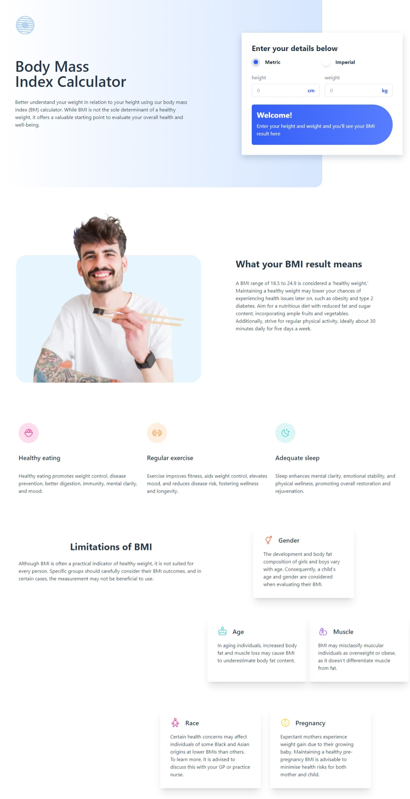

# Frontend Mentor - Interactive card details form solution

This is a body mass index calculator 

## Table of contents

- [Overview](#overview)
  - [The challenge](#the-challenge)
  - [Screenshot](#screenshot)
  - [Links](#links)
- [My process](#my-process)
  - [Built with](#built-with)
  - [What I learned](#what-i-learned)
  - [Continued development](#continued-development)
- [Author](#author)
- [Acknowledgments](#acknowledgments)

**Note: Delete this note and update the table of contents based on what sections you keep.**

## Overview

### The challenge

Your users should be able to:

- Select whether they want to use metric or imperial units
- Enter their height and weight
- See their BMI result, with their weight classification and healthy weight range
- View the optimal layout for the interface depending on their device's screen size
- See hover and focus states for all interactive elements on the page

### Screenshot

### Links

- Solution URL: [solution URL](https://github.com/Silkiercomet/bmi-calculator)
- Live Site URL: [ live site URL ](https://silkiercomet.github.io/bmi-calculator/)

## My process

We first created the html for the general structure of each section of the page, we stiked to it when declaring the utilities classes of tailwind for the css

### Built with

- Semantic HTML5 markup
- tailwindcss
- Javascript

### What I learned

A great practice for tailwindcss, it teach me the ins and outs of utilities classes, and helped me to wrestle with some ideas of tailwind y made me love it, now I see the usufulness of using a utilities classes workflow 

### Continued development

The application main functionalities is done and is hard to see and improvement in this page, but you can better the JS to look more clean

## Author

- Website - [Add your name here](https://luis-colina-portfolio.netlify.app/)

## Acknowledgments

in the espace between the form inputs is better to use grid, it gives you better control over the workflow and is easy to get the required layout, with flex it was a nighmare to pull it our and after accomplished it has weird behaviors 

